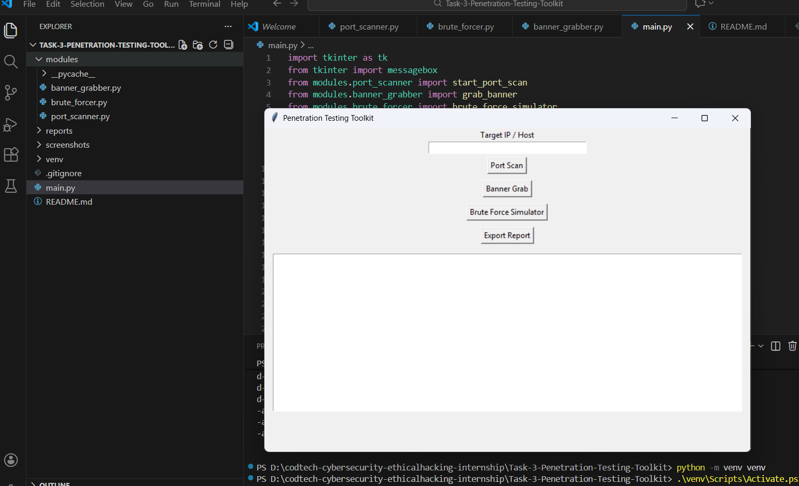
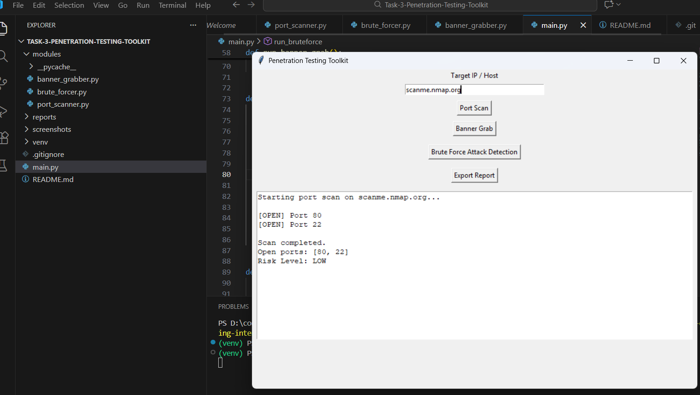
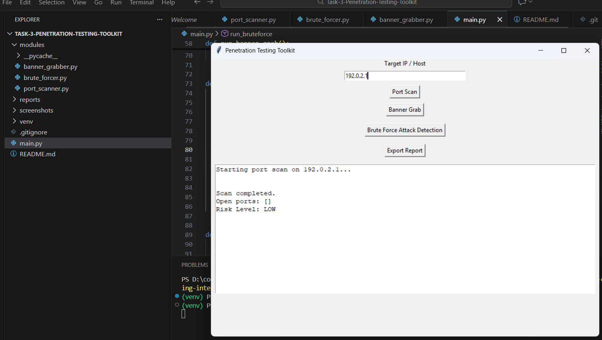
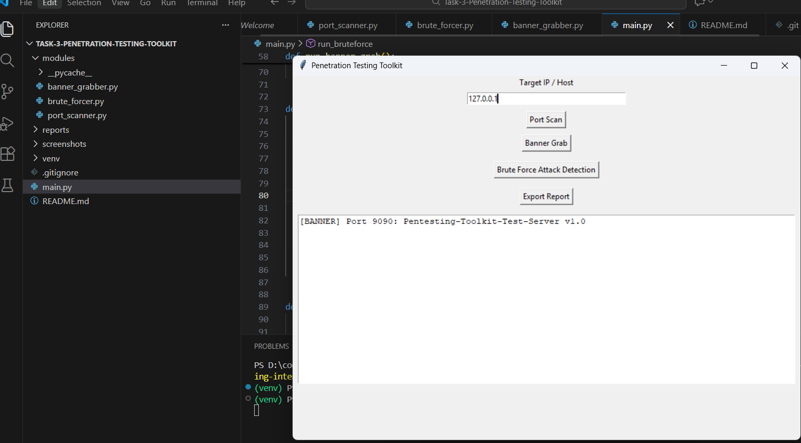
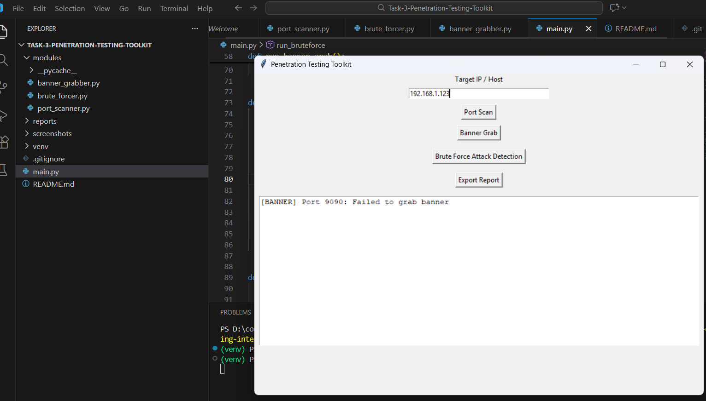
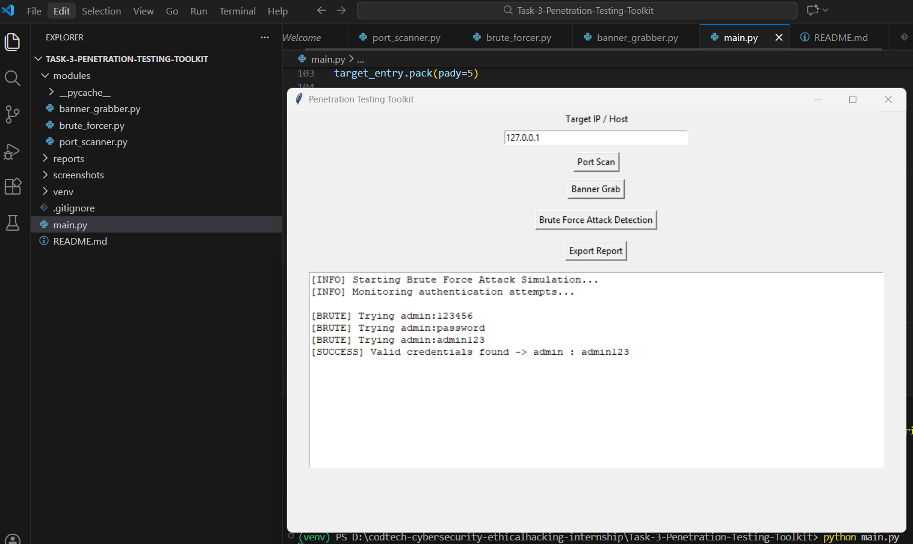
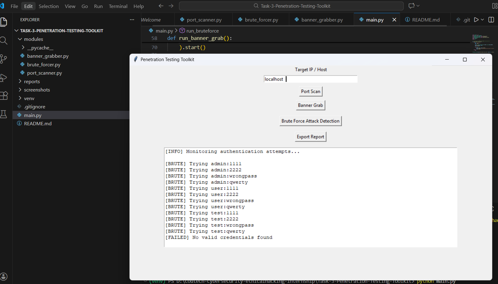
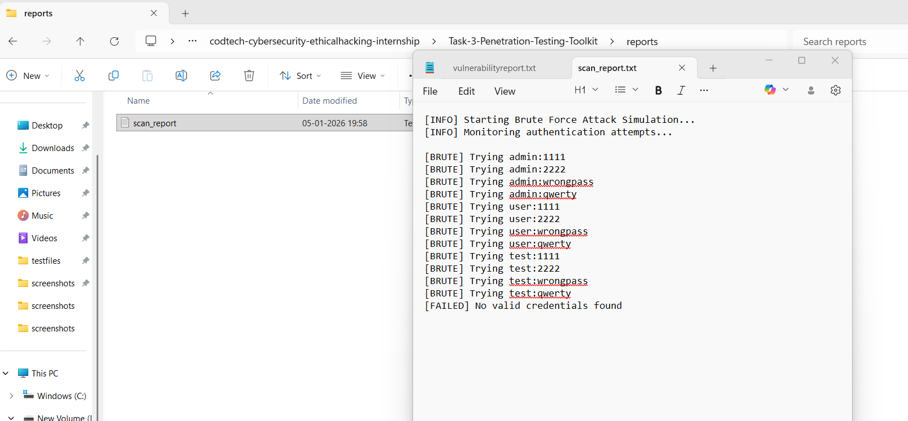

# 🛡️ Penetration Testing Toolkit (GUI Based)

## 📌 Project Description

This project is a **GUI-based Penetration Testing Toolkit** developed using **Python** as part of a **Cybersecurity & Ethical Hacking Internship**.

The toolkit demonstrates **core penetration testing techniques** in a **safe, simulated environment**, allowing users to understand how attackers identify weaknesses in systems.

The tool includes the following modules:

- **Port Scanning**
- **Banner Grabbing**
- **Brute Force Attack Simulation**

All results are displayed through a **Tkinter-based graphical user interface**, making it beginner-friendly and suitable for **internship evaluation and academic demonstrations**.

> ⚠️ **Disclaimer:**  
> This tool is created **strictly for educational and internship purposes**.  
> Perform testing **only on systems you own or have explicit permission to test**.

---

## 🎯 Key Features

- GUI-based interface using **Tkinter**
- TCP **Port Scanning** to identify open ports
- **Banner Grabbing** to fetch service information
- **Brute Force Attack Simulation** (success & failure cases)
- Multi-threaded scanning for better performance
- Real-time output display in GUI
- Screenshot-based result documentation
- Clean and modular project structure
- Designed for cybersecurity internship submission

---

## 🧰 Technologies Used

- **Python 3**
- **Tkinter** – GUI development
- **Socket** – Network communication
- **Threading** – Concurrent execution
- **OS Module** – File handling

---

### 📂 Project Structure

```
TASK-3-PENETRATION-TESTING-TOOLKIT/
│
├── modules/
│ ├── pycache/
│ ├── banner_grabber.py
│ ├── brute_forcer.py
│ └── port_scanner.py
│
├── reports/
│
├── screenshots/
│ ├── gui.png
│ ├── portscansuccess.png
│ ├── portscanfailure.png
│ ├── bannergrabsuccess.png
│ ├── bannergrabfailure.png
│ ├── bruteforcesuccess.png
│ ├── bruteforcefailure.png
│ ├── reportoutput.png
│ └── reportsuccess.png
│
├── venv/
├── .gitignore
├── main.py
└── README.md
```


---

## ⚙️ Installation & Execution

### 1️⃣ Create and Activate Virtual Environment (Recommended)

```bash
python -m venv venv
```

### Activate (Windows):
venv\Scripts\activate

### 2️⃣ Run the Application
python main.py


### 🖥️ How the Toolkit Works
🔹 Target Input

Target IP (e.g., 127.0.0.1)

Target Port (e.g., 22, 80, 8080)

🔹 Port Scanning

Scans ports and shows OPEN/CLOSED status

🔹 Banner Grabbing

Connects to open ports to retrieve service info

🔹 Brute Force Simulation

Shows success & failure login attempts

Safe simulation – no real systems harmed

🔹 Result Display

All output displayed instantly in GUI

Designed for screenshot documentation

### 🧪 Sample Inputs


| Module      | Sample Input                            |
| ----------- | --------------------------------------- |
| Port Scan   | IP: `127.0.0.1`, Port: `80`             |
| Banner Grab | IP: `127.0.0.1`, Port: `8080`           |
| Brute Force | Username: `admin`, Password: `admin123` |


### ⚠️ Disclaimer

Only for educational/internship purposes

Do not test unauthorized systems


###  📸 Screenshots

All screenshots are stored inside the **screenshots/** folder.

---

### 🖥️ GUI Interface



---

### ✅ Port Scan – Success



---

### ❌ Port Scan – Failure



---

### ✅ Banner Grabbing – Success



---

### ❌ Banner Grabbing – Failure



---

### ✅ Brute Force – Success



---

### ❌ Brute Force – Failure



---

### 📄 Report Output



---

### ✅ Report Generated Successfully


